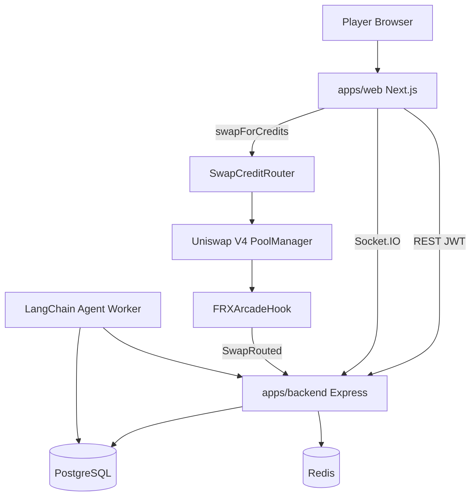

# FRX Arcade Architecture

Liquidity-powered competitive gaming on X Layer via **Uniswap V4 Hooks**.

## System overview



## Core flows

### 1. Swap → FRX Credits (V4 hook path)

1. User connects OKX wallet on X Layer testnet (chain 1952).
2. User calls `SwapCreditRouter.swapForCredits{value: okb}()`.
3. Router unlocks `PoolManager`, executes swap on hooked OKB/aQUOTE pool.
4. `FRXArcadeHook.afterSwap` captures fee, splits to treasury / jackpot / ecosystem.
5. Router mints FRX Credits via `CreditManager`.
6. Backend verifies tx (`Swap` + `SwapRouted` + `CreditsPurchased`) before updating ledger.

### 2. Tournament play

1. User spends FRX Credits to join `TournamentPool`.
2. Three Tile Rush attempts; **total score = sum of all 3 attempt match counts**.
3. Client submits signed score payloads with replay nonce.
4. Backend validates heuristics + AI summary → leaderboard patch via Socket.IO.
5. Settlement: `RewardDistributor` merkle claims post-close.

### 3. Hook-powered economy

Every swap through the hooked pool triggers `afterSwap` fee capture (5% of output), then splits (bps):

| Bucket | Default bps |
|--------|-------------|
| Tournament treasury | 4000 |
| Daily jackpot | 3500 |
| Ecosystem reserve | 2500 |

`FRXArcadeHook` emits `SwapRouted` — indexed by `hookIndexer` worker into `HookMetricsDaily`.

### 4. AI Tournament Agent

Background worker reads liquidity metrics, proposes tournaments, flags suspicious scores, logs decisions to `AISignal` for admin review.

## Monorepo layout

| Path | Role |
|------|------|
| `apps/web` | Next.js 15 UI, Phaser game mount, wagmi |
| `apps/backend` | Express REST, Prisma, Socket.IO, hook indexer, agent worker |
| `packages/shared` | Zod schemas, types, socket event contracts |
| `packages/contracts` | V4 Hook, SwapCreditRouter, vaults, credits |
| `packages/game-engine` | Phaser 3 Tile Rush + shared rules |

## Security

- SIWE-style wallet auth → JWT httpOnly cookie
- Credit deposit: on-chain V4 swap verification (no direct OKB send)
- Score submission: nonce + signature + event hash replay protection
- Rate limits per IP/wallet (Redis)
- Admin routes gated by wallet allowlist

## Local development

```bash
docker compose up -d
cp .env.example .env
npm install && npm run db:generate
npm run db:push --workspace=@frx/backend
npm run dev
```

Deploy contracts to testnet for full swap flow — see [docs/HACKATHON.md](docs/HACKATHON.md).
